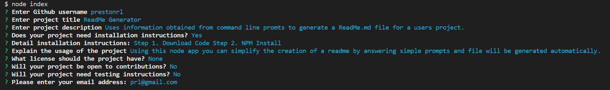

  # ReadMe Generator
  
  ## Description
  This Node application will use information obtained from command line promts to generate a ReadMe.md file for a users project that can be copied to their GitHub project.

  
  ## Table of Contents
  * [Installation](#installation)
  * [Usage](#usage)
  
  
  
  * [Questions](#questions)
  
  ## Installation
  Step 1. Download Code (clone repository)\
  Step 2. Navigate to projects root directory in terminal\
  Step 3. Run the "npm init" command\
  Step 4. Run the "node index" command
  
  ## Usage
  Using this node app will simplify the creation of a ReadMe.md file for a GitHub project. By answering simple command line prompts a file will be generated automatically and put into the "dist" folder.

  See the following video for a demonstration: [demo](https://drive.google.com/file/d/1s2k216tBNLGKep4nTrOT27NRqxjtBPb5/view)
  
  
  ## Questions
  Created by: prestonrl
  
  If you have questions please contact [prestonrl](tubasthebest@gmail.com)